# Markdown Feature Showcase

This document demonstrates the complete range of markdown rendering capabilities, including text formatting, diagrams, code blocks, and interactive elements.

## Table of Contents

- [Text Formatting](#text-formatting)
- [Lists and Structure](#lists-and-structure)
- [Code Examples](#code-examples)
- [Diagram Examples](#diagram-examples)
  - [Mermaid Diagrams](#mermaid-diagrams)
  - [PlantUML Diagrams](#plantuml-diagrams)
- [Tables](#tables)
- [Links and References](#links-and-references)
- [Blockquotes](#blockquotes)

## Text Formatting

### Basic Text Styles

This is **bold text** and this is *italic text*. You can also use `inline code` and ~~strikethrough text~~.

### Headers

# H1 Header
## H2 Header
### H3 Header
#### H4 Header
##### H5 Header
###### H6 Header

### Emphasis Examples

- **Important note**: This is crucial information
- *Subtle emphasis*: This requires attention
- ***Very important***: This combines both bold and italic
- `Code reference`: This refers to code elements

## Lists and Structure

### Unordered Lists

- Frontend Technologies
  - React
  - TypeScript
  - Vite
- Backend Technologies
  - Go
  - Node.js
  - Python
- Databases
  - PostgreSQL
  - Redis
  - MongoDB

### Ordered Lists

1. **Planning Phase**
   1. Requirements gathering
   2. Architecture design
   3. Technology selection
2. **Development Phase**
   1. Setup environment
   2. Implement core features
   3. Add integrations
3. **Testing Phase**
   1. Unit tests
   2. Integration tests
   3. End-to-end tests

### Task Lists

- [x] Set up development environment
- [x] Create project structure
- [x] Implement markdown parser
- [x] Add diagram support
- [ ] Add collaborative features
- [ ] Implement real-time sync
- [ ] Deploy to production

## Code Examples

### Inline Code

Use the `npm install` command to install dependencies. The `React.useState` hook manages component state.

### JavaScript Example

```js
// React component with hooks
import React, { useState, useEffect } from 'react';

function UserProfile({ userId }) {
    const [user, setUser] = useState(null);
    const [loading, setLoading] = useState(true);

    useEffect(() => {
        async function fetchUser() {
            try {
                const response = await fetch(`/api/users/${userId}`);
                const userData = await response.json();
                setUser(userData);
            } catch (error) {
                console.error('Failed to fetch user:', error);
            } finally {
                setLoading(false);
            }
        }

        fetchUser();
    }, [userId]);

    if (loading) return <div>Loading...</div>;
    if (!user) return <div>User not found</div>;

    return (
        <div className="user-profile">
            <h2>{user.name}</h2>
            <p>{user.email}</p>
        </div>
    );
}

export default UserProfile;
```

### Go Example

```go
package main

import (
    "context"
    "fmt"
    "log"
    "net/http"
    "time"
)

type Server struct {
    port string
}

func NewServer(port string) *Server {
    return &Server{port: port}
}

func (s *Server) Start(ctx context.Context) error {
    mux := http.NewServeMux()
    
    // Health check endpoint
    mux.HandleFunc("/health", func(w http.ResponseWriter, r *http.Request) {
        w.WriteHeader(http.StatusOK)
        fmt.Fprint(w, "OK")
    })

    // API endpoints
    mux.HandleFunc("/api/users", s.handleUsers)
    
    server := &http.Server{
        Addr:    ":" + s.port,
        Handler: mux,
        ReadTimeout: 15 * time.Second,
        WriteTimeout: 15 * time.Second,
    }

    go func() {
        <-ctx.Done()
        server.Shutdown(context.Background())
    }()

    fmt.Printf("Server starting on port %s\n", s.port)
    return server.ListenAndServe()
}

func (s *Server) handleUsers(w http.ResponseWriter, r *http.Request) {
    // Implementation here
}
```

### Python Example

```py
import asyncio
import aiohttp
from dataclasses import dataclass
from typing import List, Optional

@dataclass
class User:
    id: int
    name: str
    email: str
    active: bool = True

class UserService:
    def __init__(self, base_url: str):
        self.base_url = base_url
        self.session: Optional[aiohttp.ClientSession] = None

    async def __aenter__(self):
        self.session = aiohttp.ClientSession()
        return self

    async def __aexit__(self, exc_type, exc_val, exc_tb):
        if self.session:
            await self.session.close()

    async def get_users(self) -> List[User]:
        """Fetch all active users from the API."""
        async with self.session.get(f"{self.base_url}/users") as response:
            if response.status == 200:
                data = await response.json()
                return [User(**user) for user in data if user.get('active', True)]
            else:
                raise aiohttp.ClientError(f"API error: {response.status}")

    async def create_user(self, name: str, email: str) -> User:
        """Create a new user."""
        payload = {"name": name, "email": email}
        async with self.session.post(f"{self.base_url}/users", json=payload) as response:
            if response.status == 201:
                data = await response.json()
                return User(**data)
            else:
                raise aiohttp.ClientError(f"Failed to create user: {response.status}")

# Usage example
async def main():
    async with UserService("https://api.example.com") as service:
        users = await service.get_users()
        print(f"Found {len(users)} active users")
        
        new_user = await service.create_user("John Doe", "john@example.com")
        print(f"Created user: {new_user.name}")

if __name__ == "__main__":
    asyncio.run(main())
```

### TypeScript Example

```ts
interface ApiResponse<T> {
    data: T;
    status: number;
    message: string;
    timestamp: Date;
}

type UserRole = 'admin' | 'user' | 'moderator';

class UserManager {
    private users: Map<string, User> = new Map();
    
    constructor(private apiClient: ApiClient) {}
    
    async fetchUser<T extends User>(id: string): Promise<ApiResponse<T>> {
        try {
            const response = await this.apiClient.get<T>(`/users/${id}`);
            this.users.set(id, response.data);
            return response;
        } catch (error) {
            throw new Error(`Failed to fetch user ${id}: ${error.message}`);
        }
    }
    
    getUsersByRole(role: UserRole): User[] {
        return Array.from(this.users.values())
            .filter(user => user.role === role);
    }
}
```

### Shell Commands

```bash
# Setup development environment
npm install
npm run dev

# Build for production
npm run build
npm run preview

# Run tests
npm test
npm run test:coverage

# Docker commands
docker build -t myapp .
docker run -p 3000:3000 myapp

# Git workflow
git checkout -b feature/new-feature
git add .
git commit -m "Add new feature"
git push origin feature/new-feature
```

### SQL Example

```sql
-- User management queries
CREATE TABLE users (
    id SERIAL PRIMARY KEY,
    email VARCHAR(255) UNIQUE NOT NULL,
    name VARCHAR(100) NOT NULL,
    created_at TIMESTAMP DEFAULT CURRENT_TIMESTAMP,
    updated_at TIMESTAMP DEFAULT CURRENT_TIMESTAMP,
    active BOOLEAN DEFAULT true
);

-- Create indexes for performance
CREATE INDEX idx_users_email ON users(email);
CREATE INDEX idx_users_active ON users(active);

-- Complex query with joins and aggregations
SELECT 
    u.name,
    u.email,
    COUNT(o.id) as order_count,
    SUM(o.total_amount) as total_spent,
    AVG(o.total_amount) as avg_order_value,
    MAX(o.created_at) as last_order_date
FROM users u
LEFT JOIN orders o ON u.id = o.user_id
WHERE u.active = true
  AND u.created_at >= '2024-01-01'
GROUP BY u.id, u.name, u.email
HAVING COUNT(o.id) > 0
ORDER BY total_spent DESC
LIMIT 100;
```

### JSON Configuration

```json
{
  "name": "markdown-preview-app",
  "version": "1.0.0",
  "description": "Advanced markdown preview with diagram support",
  "main": "dist/index.js",
  "scripts": {
    "dev": "vite",
    "build": "tsc && vite build",
    "preview": "vite preview",
    "test": "jest",
    "lint": "eslint src --ext .ts,.tsx"
  },
  "dependencies": {
    "react": "^18.2.0",
    "marked": "^5.0.0",
    "mermaid": "^10.0.0",
    "plantuml-encoder": "^1.4.0"
  },
  "devDependencies": {
    "@types/react": "^18.0.0",
    "typescript": "^5.0.0",
    "vite": "^4.0.0"
  },
  "engines": {
    "node": ">=16.0.0"
  }
}
```

### YAML Configuration

```yaml
# Docker Compose configuration
version: '3.8'

services:
  web:
    build: .
    ports:
      - "3000:3000"
    environment:
      - NODE_ENV=production
      - DATABASE_URL=postgresql://user:pass@db:5432/myapp
    depends_on:
      - db
      - redis
    restart: unless-stopped

  db:
    image: postgres:15
    environment:
      POSTGRES_DB: myapp
      POSTGRES_USER: user
      POSTGRES_PASSWORD: pass
    volumes:
      - postgres_data:/var/lib/postgresql/data
    ports:
      - "5432:5432"

  redis:
    image: redis:7-alpine
    command: redis-server --appendonly yes
    volumes:
      - redis_data:/data
    ports:
      - "6379:6379"

volumes:
  postgres_data:
  redis_data:
```

## Diagram Examples

### Mermaid Diagrams

#### Flowchart - System Architecture

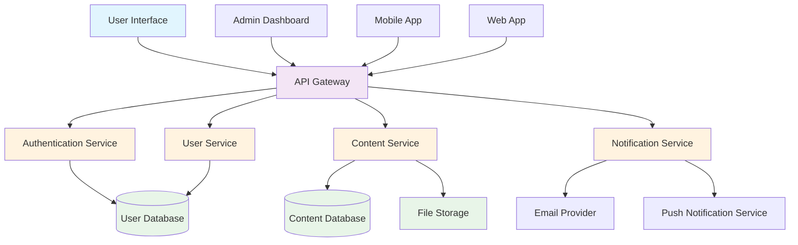

#### Sequence Diagram - User Authentication

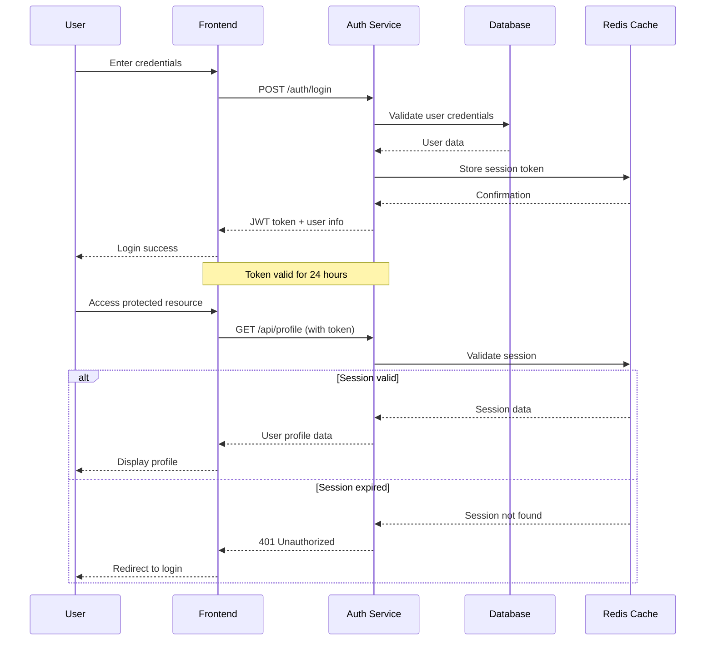

#### State Diagram - Order Processing

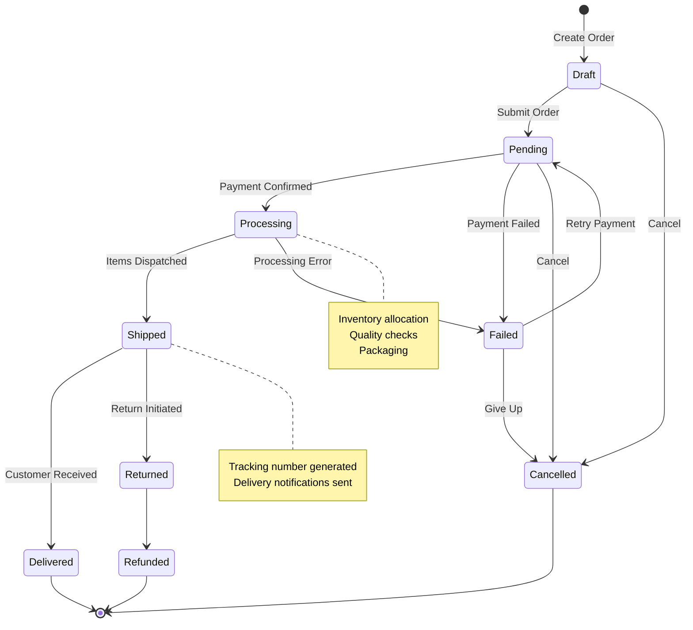

#### Class Diagram - User Management System

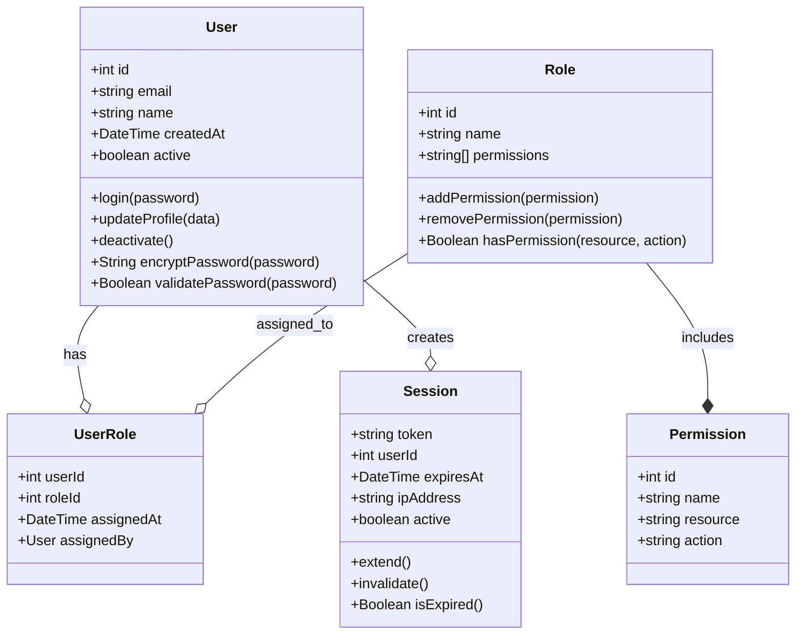

#### Entity Relationship Diagram - E-commerce Database

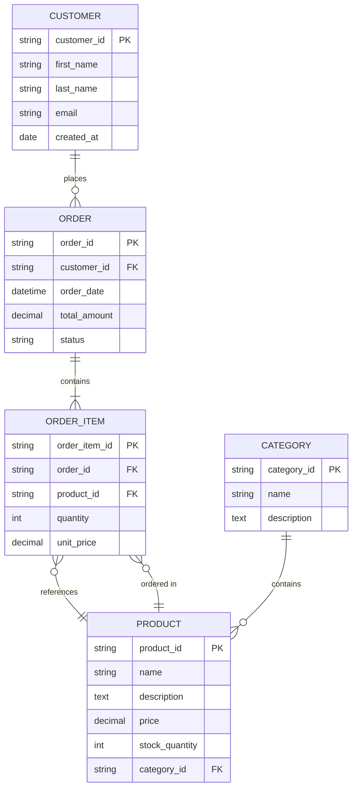

#### Gantt Chart - Project Timeline

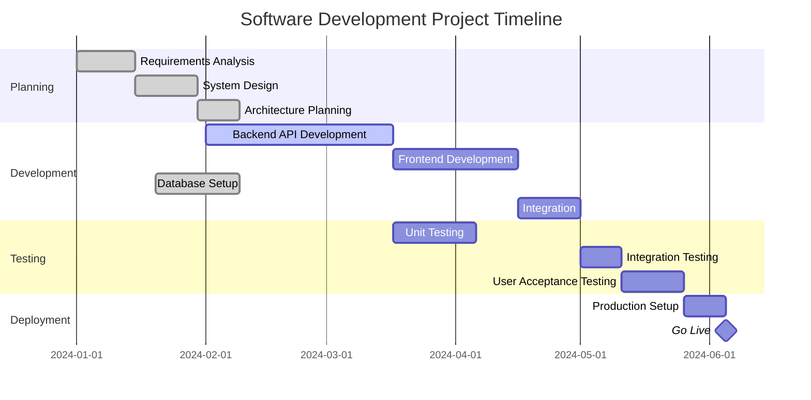

#### Pie Chart - Technology Stack Usage

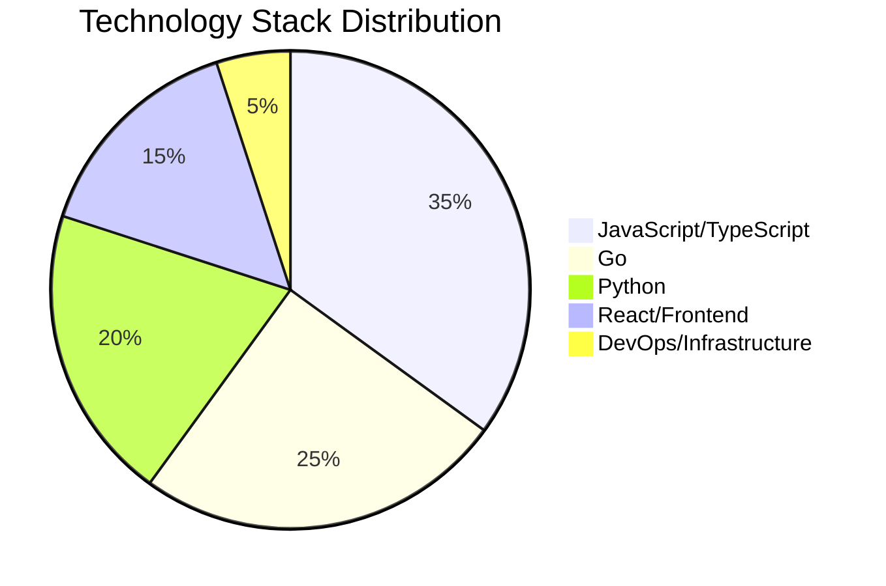

#### User Journey Map - Customer Onboarding

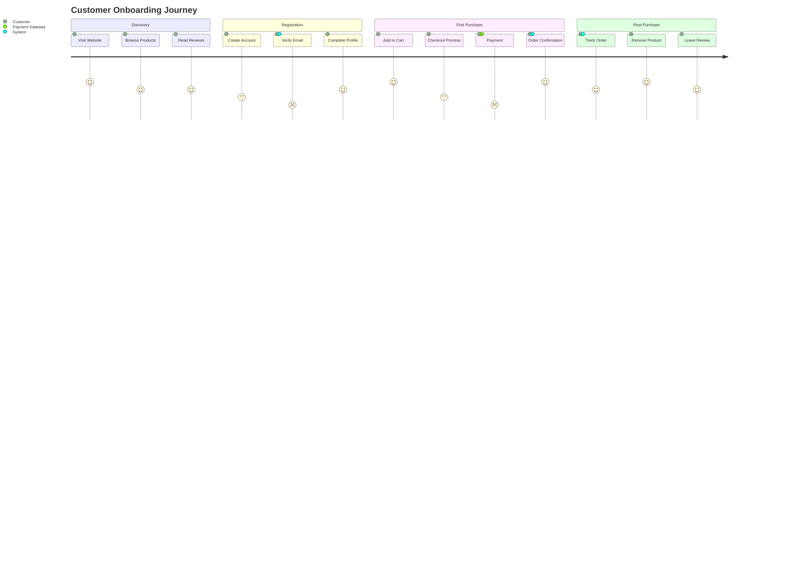

#### Git Flow Diagram - Development Workflow

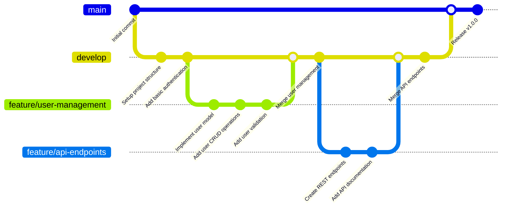

#### Mindmap - Application Architecture

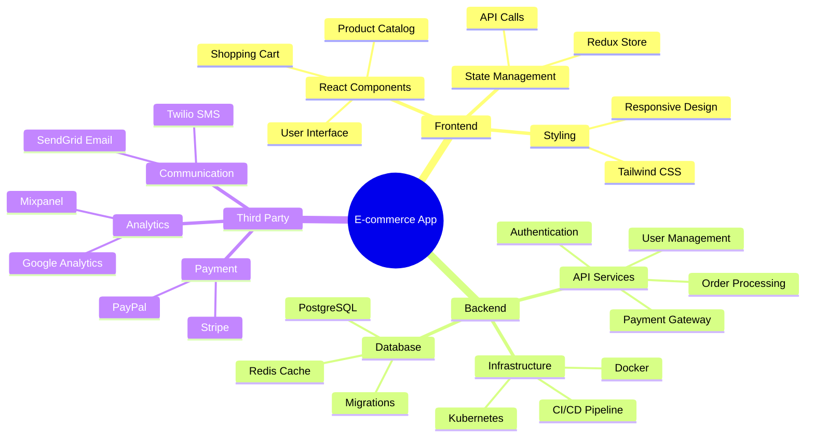

### PlantUML Diagrams

#### Component Diagram - Microservices Architecture (Failed to Render)

```plantuml
@startuml
!define RECTANGLE class

package "Frontend Layer" {
    RECTANGLE WebApp
    RECTANGLE MobileApp
    RECTANGLE AdminPanel
}

package "API Gateway" {
    RECTANGLE Gateway
    RECTANGLE LoadBalancer
}

package "Microservices" {
    RECTANGLE UserService
    RECTANGLE AuthService
    RECTANGLE ProductService
    RECTANGLE OrderService
    RECTANGLE PaymentService
    RECTANGLE NotificationService
}

package "Data Layer" {
    database UserDB
    database ProductDB
    database OrderDB
    cache Redis
    queue MessageQueue
}

package "External Services" {
    RECTANGLE PaymentGateway
    RECTANGLE EmailService
    RECTANGLE SMSService
}

WebApp --> Gateway
MobileApp --> Gateway
AdminPanel --> Gateway

Gateway --> LoadBalancer
LoadBalancer --> UserService
LoadBalancer --> AuthService
LoadBalancer --> ProductService
LoadBalancer --> OrderService
LoadBalancer --> PaymentService
LoadBalancer --> NotificationService

UserService --> UserDB
UserService --> Redis
AuthService --> UserDB
AuthService --> Redis
ProductService --> ProductDB
OrderService --> OrderDB
OrderService --> MessageQueue
PaymentService --> PaymentGateway
NotificationService --> EmailService
NotificationService --> SMSService
NotificationService --> MessageQueue

@enduml
```

#### Use Case Diagram - E-commerce System

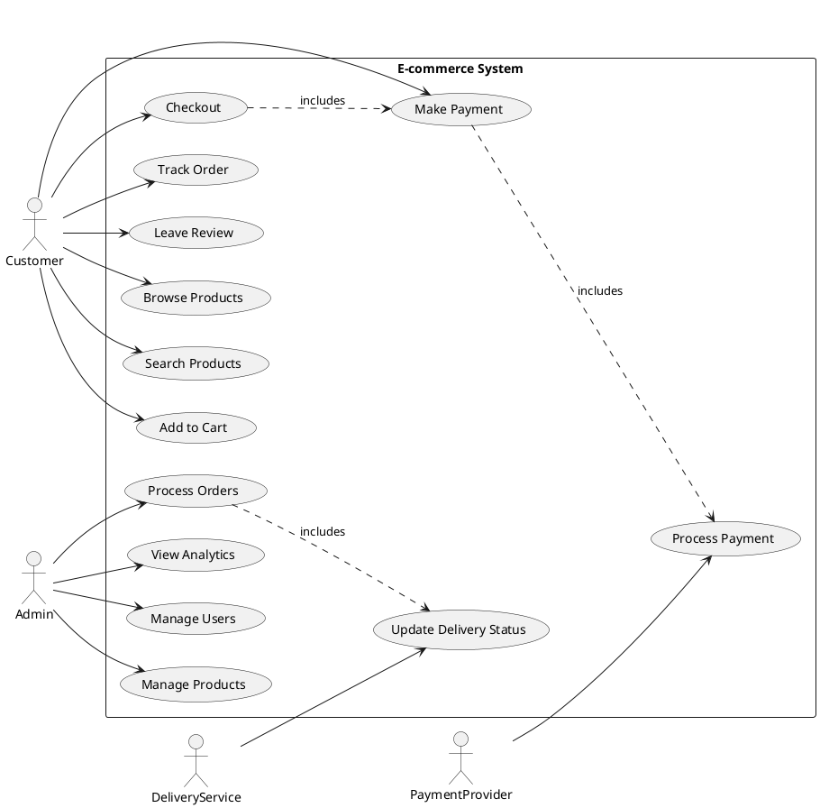

#### Activity Diagram - Order Fulfillment Process

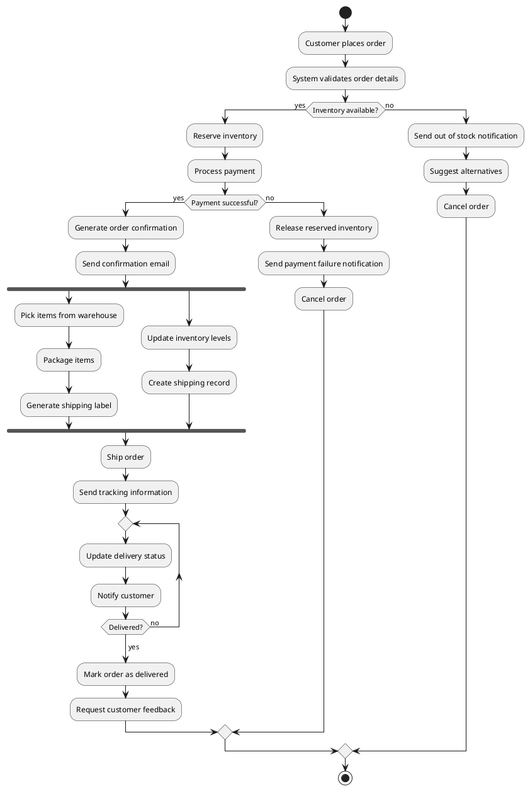

## Tables

### Feature Comparison

| Feature | Basic Plan | Pro Plan | Enterprise |
|---------|------------|----------|------------|
| **Users** | Up to 5 | Up to 50 | Unlimited |
| **Storage** | 1 GB | 100 GB | 1 TB |
| **API Calls** | 1,000/month | 100,000/month | Unlimited |
| **Support** | Email | Priority Email | 24/7 Phone |
| **Custom Integrations** | ❌ | ✅ | ✅ |
| **Analytics** | Basic | Advanced | Advanced + Custom |
| **SLA** | 99.5% | 99.9% | 99.99% |
| **Price** | Free | $29/month | Contact Sales |

### Technology Stack

| Layer | Technology | Purpose | Notes |
|-------|------------|---------|-------|
| **Frontend** | React 18 | User interface | With TypeScript |
| **Build Tool** | Vite | Development & build | Fast HMR |
| **State Management** | Redux Toolkit | Global state | With RTK Query |
| **Styling** | Tailwind CSS | Utility-first CSS | Custom design system |
| **Backend** | Node.js + Express | API server | RESTful APIs |
| **Database** | PostgreSQL | Primary database | With connection pooling |
| **Cache** | Redis | Session & data cache | Distributed cache |
| **Message Queue** | RabbitMQ | Async processing | Event-driven architecture |
| **Monitoring** | Prometheus + Grafana | Metrics & alerting | Custom dashboards |
| **Deployment** | Docker + Kubernetes | Container orchestration | Multi-region |

## Links and References

### Internal Links
- [Text Formatting](#text-formatting)
- [Diagram Examples](#diagram-examples)
- [Code Examples](#code-examples)

### External Links
- [Markdown Guide](https://www.markdownguide.org/)
- [Mermaid Documentation](https://mermaid.js.org/)
- [PlantUML Website](https://plantuml.com/)
- [React Documentation](https://react.dev/)
- [TypeScript Handbook](https://www.typescriptlang.org/docs/)

### Reference Documentation
- [API Reference](https://api.example.com/docs)
- [SDK Documentation](https://sdk.example.com/docs)
- [Integration Guides](https://guides.example.com/)

## Blockquotes

> **💡 Pro Tip**: Use diagrams to visualize complex workflows and system architectures. They make documentation more accessible and easier to understand.

> **⚠️ Important**: Always validate user input and sanitize data before processing. Security should be a primary consideration in all development phases.

> **📝 Note**: This markdown file demonstrates various rendering capabilities including:
> - Complex diagrams with right-click Copy as PNG functionality
> - Syntax highlighting for multiple programming languages
> - Interactive elements and styling
> - Comprehensive formatting options

### Best Practices Quote

> "Documentation is a love letter that you write to your future self."
> 
> — Damian Conway

### Multi-paragraph Quote

> The best way to learn is by doing. Start with small projects and gradually work your way up to more complex systems.
> 
> Don't be afraid to make mistakes – they're often the best teachers. Each error is an opportunity to understand the system better.
> 
> Remember that good code is not just functional, but also readable, maintainable, and well-documented.

---

## Conclusion

This document showcases the comprehensive markdown rendering capabilities of the preview system, including:

- ✅ **Text Formatting**: Headers, emphasis, lists, and inline elements
- ✅ **Code Highlighting**: Multi-language syntax highlighting
- ✅ **Mermaid Diagrams**: Flowcharts, sequence diagrams, state diagrams, and class diagrams
- ✅ **PlantUML Diagrams**: Component diagrams, use case diagrams, and activity diagrams
- ✅ **Interactive Features**: Right-click context menu for copying diagrams as PNG
- ✅ **Tables**: Complex data presentation with formatting
- ✅ **Links & References**: Internal and external navigation
- ✅ **Blockquotes**: Styled callouts and quotations

The preview system provides a rich, interactive experience for viewing and working with markdown content, making it ideal for technical documentation, project planning, and collaborative development.