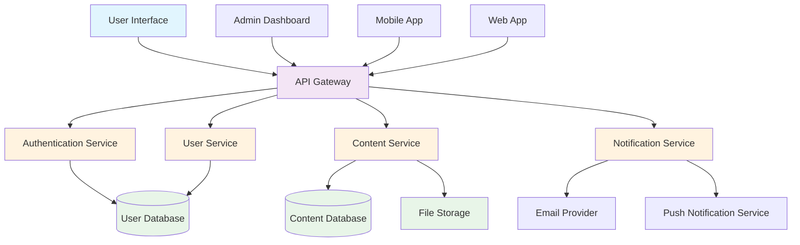

# Flowchart - System Architecture2

```mermaid
graph TB
    A[User Interface] --> B[API Gateway]
    B --> C[Authentication Service]
    B --> D[User Service]
    B --> E[Content Service]
    
    C --> F[(User Database)]
    D --> F
    E --> G[(Content Database)]
    E --> H[File Storage]
    
    B --> I[Notification Service]
    I --> J[Email Provider]
    I --> K[Push Notification Service]
    
    L[Admin Dashboard] --> B
    M[Mobile App] --> B
    N[Web App] --> B
    
    style A fill:#e1f5fe
    style B fill:#f3e5f5
    style C fill:#fff3e0
    style D fill:#fff3e0
    style E fill:#fff3e0
    style I fill:#fff3e0
    style F fill:#e8f5e8
    style G fill:#e8f5e8
    style H fill:#e8f5e8
```
